# LABORA Chain (labora-chain) flow — percepatan progres LIVELIHOOD

Diagram alur completionType `labora-chain` (founder request 19 Agustus:
"setiap task ada 2-3 fitur LABORA yang harus diselesaikan agar prosesnya
cepat"), sesuai kode di `server/laboraChain.js`, `server/claude.js`,
`server/index.js`, dan `public/app.js`. Dokumen ini WAJIB tetap akurat
terhadap kode — kalau alur berubah, update diagram ini juga.

Prinsip inti: SATU quest harian LIVELIHOOD = rantai 2-3 langkah LABORA yang
dikerjakan berurutan (urutan kanonik: video-quiz → job-match-analysis →
job-application-submit). Sebelumnya pasangan Job Match → Submit Application
tersebar di dua hari lewat jobMatchHint; chain memampatkannya ke satu hari.
Setiap langkah memakai flow + route fitur yang SUDAH ADA — chain hanya
mengubah apa yang terjadi saat sebuah langkah selesai: menyimpan hasil
langkah dan maju, bukan menutup quest. Reflection ditulis TEPAT SEKALI, di
langkah terakhir.

```mermaid
flowchart TD
    GQ["generateQuest (server/claude.js)\nenum + aturan: labora-chain untuk goal job-hunting\nyang progresnya perlu dipercepat; step video-quiz hanya kalau\nada skill-gap layak dipelajari (ctx.jobMatchHint.gap);\nstep submit hanya kalau ada job-match di chain ATAU hint qualified"] --> NORM["normalizeLaboraChain (defense-in-depth, server/laboraChain.js):\nfitur tak dikenal dibuang, dedupe, urutan kanonik dipaksa,\nsubmit dibuang kalau tak akan pernah bisa diselesaikan,\nclamp 2-3 langkah; <2 langkah tersisa → DOWNGRADE ke\ncompletionType job-match-analysis biasa (bukan chain rusak).\nChain dengan step video-quiz mempertahankan quest.videoQuiz"]
    NORM --> SHAPE["quest.laboraChain = { currentIndex, steps:[{feature,\nstatus active|pending|done|skipped, result, note}] }\n(dipatch via db.updateQuestProgress — pola videoQuizState;\nreflection quest tetap NULL sampai langkah terakhir)"]

    SHAPE --> CARD["Dashboard: eyebrow 'QUEST HARI INI · LIVELIHOOD:\n<FITUR> · LANGKAH n/m', checklist per langkah\n(✓ done / ▶ aktif / ○ pending / ⤼ dilewati),\nCTA 'Mulai|Lanjut: <fitur>' (questCtaLabel)"]
    CARD --> DISPATCH["Handler data-reflect-id (branch labora-chain):\nrefresh /api/state dulu (lesson staleness), lalu dispatch\nke flow fitur langkah SAAT INI: startVideoQuiz /\nlaunchJobMatchFlow / launchJobApplicationFlow (di-extract,\nbody asli verbatim)"]

    DISPATCH --> GUARD["Semua route fitur pakai guard resolveChainStep(day, feature):\nterima quest biasa bertipe fitur itu ATAU chain yang langkah\nSAAT INI-nya fitur itu — selain itu 400 (test: memanggil\njob-match saat langkahnya masih video-quiz ditolak)"]

    GUARD --> VQ["Step video-quiz: validate/start/submit\nPERSIS seperti quest video-quiz biasa (lock, retry, dsb.).\nGAGAL assessment: chain TIDAK maju, lock bertahan, quest terbuka.\nLULUS: hasil ringkas jadi step.result → advanceChain;\nrespons membawa chain:{completed:false, nextFeature} —\nlayar hasil menampilkan 'Lanjut: Job Match', TANPA deltas/reflection"]
    GUARD --> JM["Step job-match-analysis: analisis + ensureQualified-\nApplicationsMilestone seperti biasa, TAPI tanpa saveReflection —\nhasil lengkap (matchTable/matchScore/qualified) jadi step.result\n→ advanceChain. AUTO-SKIP: kalau qualified=false dan langkah\nberikutnya submit, langkah submit di-mark 'skipped' + note\n(user tidak boleh macet) — biasanya chain langsung selesai di sini"]
    GUARD --> JA["Step job-application-submit: validasi form + gerbang qualified\nCHAIN-AWARE — pakai hasil job-match DI DALAM chain kalau ada\n(bukan recentDays); chain tanpa step job-match (dibangun dari\nhint qualified) tetap pakai re-check recentDays lama.\nMilestone counter naik seperti biasa. Submit = langkah kanonik\nterakhir → advanceChain selalu menyelesaikan chain"]

    VQ --> DONE_Q{"advanceChain →\ncompleted?"}
    JM --> DONE_Q
    JA --> DONE_Q
    DONE_Q -- "belum" --> PATCH["db.updateQuestProgress {laboraChain}\nquest tetap terbuka; klien refetch state →\ncard menampilkan langkah berikutnya"]
    PATCH -.-> CARD
    DONE_Q -- "ya" --> FINAL["completeLaboraChain (server/index.js) — SATU-SATUNYA\ncompletion untuk chain: processReflection dengan\nctx.laboraChainResult (ringkasan headline per langkah,\nbukti objektif, statDeltas WAJIB; langkah skipped BUKAN\nkegagalan) → clamp deltas → growthSessions → gerbang chapter →\nsaveReflection {laboraChainResult, videoQuizResult?,\njobMatchResult?, jobApplicationSubmit?} → touchStatActivity\n→ updateState"]
    FINAL --> COMPAT["Kompatibilitas: jobMatchResult/jobApplicationSubmit\ndi-embed TOP-LEVEL di reflection, jadi lookup recentDays\nyang sudah ada (jobMatchHint di GET /api/state + gerbang\nqualified route submit) tetap bekerja tanpa diubah:\nchain gagal-qualify → hint besok mengarah skill-building;\nchain lengkap → hint netral (submit terbaru ≥ analisis)"]
```

Penjelasan node yang tidak jelas dari namanya:

- **Kenapa completionType baru, bukan array quest** — satu baris `days`
  tetap satu quest ("open" = `reflection IS NULL` tidak berubah); langkah
  antar-fitur hidup di `quest.laboraChain` lewat `updateQuestProgress`,
  pola persis `quest.progressive` (nutrition) dan `quest.videoQuizState`.
- **Auto-skip submit** — keputusan produk: chain tidak boleh memacetkan
  user. Job match tidak lolos → langkah submit `skipped` dengan note, chain
  selesai dengan langkah tersisa; Milestone TIDAK naik (tidak ada lamaran
  yang difabrikasi), dan reflection final membawa `jobMatchResult.qualified
  false` sehingga quest besok menyasar gap-nya (mekanisme jobMatchHint lama).
- **Growth sekali di akhir** — langkah-langkah perantara merespons dengan
  `deltas: {}` dan tanpa mentorReply; hanya `completeLaboraChain` memanggil
  `processReflection` (branch `ctx.laboraChainResult`, dicek paling awal)
  dan menaikkan stats/growthSessions — mencegah growth dobel dari satu hari.
- **META & quest lama tidak tersentuh** — META rows tidak pernah membuat
  chain; quest single-feature (job-match-analysis dll.) lewat jalur lama
  verbatim (`resolveChainStep` mengembalikan `{chain:null}` untuk mereka).
- **Expiry 28 jam** — berlaku ke chain apa adanya (lifecycle "session"):
  chain setengah jalan yang terbengkalai kedaluwarsa netral, goal-nya dapat
  quest baru — konsekuensi yang diterima, tidak ada kode khusus.
- **Keyless** — generateQuest keyless tidak pernah memancarkan chain
  (fallbackQuest); route-route chain tetap bekerja keyless (job-match
  fallback selalu `qualified:false` → jalur auto-skip; dipakai e2e).

Tes: `tests/laborachain.js` (unit normalizeChain/advanceChain/summary +
normalizeLaboraChain) dan `tests/laborachain.e2e.js` (checklist/CTA/eyebrow,
step video-quiz lulus tanpa reflection, auto-skip menyelesaikan chain dengan
SATU reflection, jalur submit qualified menaikkan Milestone, guard langkah
salah + guard unqualified).
