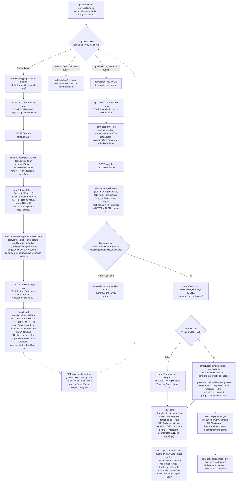

# Livelihood Milestone flow — Task 14 (PRD.md section 26)

Diagram alur Milestone eksplisit untuk Primary Quest Livelihood dan Job Match
Analysis versi evidence-based, sesuai kode di `server/targets.js`,
`server/jobMatch.js`, `server/jobApplication.js`, `server/claude.js`,
`server/index.js`, dan `public/app.js`. Dokumen ini WAJIB tetap akurat
terhadap kode — kalau alur berubah, update diagram ini juga.

Penjelasan node yang tidak jelas dari namanya:

- **ctx.jobMatchHint** — dihitung server-side di `GET /api/state` (needySlots
  loop), BUKAN diserahkan ke AI untuk disimpulkan dari `recentDays` mentah
  (prinsip defense-in-depth yang sama dengan `targetReached`/`qualified`):
  scoped per-goal lewat `db.recentDays(userId, {goalIndex, limit:5})`, cari
  `job-match-analysis` TERBARU untuk goal ini yang belum punya
  `job-application-submit` SESUDAHNYA (dibandingkan lewat id row). Prompt
  `generateQuest` cuma diberi hint jadi/tidaknya, bukan mentah recentDays,
  supaya completionType hari ini tidak pernah salah rute.
- **qualified (matchScore >= 70)** — satu-satunya sinyal deterministik yang
  menentukan verdict lolos/tidak (keputusan founder: bukan penilaian naratif
  AI semata). `matchScore` sendiri tetap dari AI (mempertimbangkan skill
  overlap DAN kesesuaian role/red flag lewat instruksi prompt), tapi ambang
  70 dan boolean `qualified` dihitung di `server/jobMatch.js`, tidak pernah
  dipercaya dari klaim bebas AI.
- **ensureQualifiedApplicationsMilestone** — beda dari target cardio/gym
  (baru ada setelah user pilih A/B/C) atau practice-test's `currentTargetFor`
  (dihitung ulang tiap baca, tidak pernah disimpan): Milestone Livelihood #1
  DIBUAT OTOMATIS saat goal ini pertama kali disentuh job-match-analysis,
  targetCount tetap 10 (keputusan founder, bukan pilihan AI/user), dan HARUS
  disimpan ke `goal_targets` supaya baris ".quest-context" Primary Quest
  bisa membacanya — kalau cuma dihitung ulang tiap baca (seperti
  practice-test), baris Milestone tidak akan pernah muncul di quest card,
  persis laporan founder yang jadi alasan task ini.
- **Milestone #2 (livelihood-funnel)** — begitu 10/10 tercapai, kind target
  goal ini BERUBAH dari `qualified-applications` ke `livelihood-funnel`
  (metrik funnel generik: label + target/current value) lewat mekanisme
  A/B/C yang SAMA persis (tidak ada komponen baru). `currentValue` metrik
  funnel ini TIDAK ada instrumentasi otomatis (belum ada yang mendeteksi
  "interview terjadi" atau "recruiter membalas") — dicatat sebagai gap yang
  diketahui di PRD.md, bukan ditutup diam-diam.
- **Tidak ada growth stat baru di job-application-submit** — keputusan
  desain eksplisit, bukan kealpaan: Task 7d sudah menutup "poin arbitrer" di
  semua completionType lain, Milestone counter goal ini SENDIRI adalah
  pengganti sinyal progress-nya (parallel dengan kenapa badge "Livelihood
  +3" dihapus di job-match-analysis, bukan dipindah ke rute lain).
