# Practice Test flow — setelah Item 1 (practiceTestSchema) + Task 13 (Objective Assessment Engine) + Round 42 (Reading Half Diagnostic)

Diagram gabungan alur practice-test dari quest generation sampai result,
sesuai kode di `server/claude.js`, `server/practiceTest.js`, `server/db.js`,
`server/index.js`, dan `public/app.js`. Dokumen ini WAJIB tetap akurat
terhadap kode — kalau alur berubah, update diagram ini juga.

```mermaid
flowchart TD
    GQ["generateQuest (server/claude.js)\nAI menulis quest harian untuk goal aktif"] --> CT{"completionType\n= practice-test?"}
    CT -- "bukan" --> OTHER["flow lain\n(reflective / structured-physical / job-match)"]
    CT -- "ya" --> PTS["practiceTestSchema {kind, track}\ndiisi HANYA kalau quest eksplisit menyebutnya;\nnormalizePracticeTestSchema membersihkan nilai liar → null"]

    PTS --> TAP["Tap 'Mulai' di dashboard\n(public/app.js, handler data-reflect-id)"]
    META["Tab META → LINGUA realm page\nReading row → POST /api/meta/start (tool practice-test)\n→ picker track (Academic/General) — kind sudah preset;\nListening row → Listening Half Diagnostic (fitur terpisah)"] --> GEN

    TAP --> DEFAULT["kind = practiceTestSchema.kind atau 'reading'\ntrack = practiceTestSchema.track atau 'academic'\n(follow-up 12 Agustus: TIDAK PERNAH nanya picker\nlagi di Today's Trial, langsung generate)"]
    DEFAULT --> GEN

    GEN["POST /api/practice-test/generate\nmigrasi skema lama → tracks; cek nextDrill track ini"] --> DRILL{"tracks[kind].nextDrill\nada?"}
    DRILL -- "ya" --> GDRILL["generatePracticeTest mode DRILL\n12 soal flat, fokus 1 kategori lemah,\nAI-generate BARU per attempt (tidak di-cache)"]
    DRILL -- "tidak, kind=reading" --> WEEKLY{"weekly_reading_tests\nsudah punya baris minggu ini\n(startOfWeekKey, Senin lokal server)\n+ track ini?"}
    DRILL -- "tidak, kind=listening\n(jalur mati per round 41,\ntidak diubah)" --> GSPRINT["generatePracticeTest mode SPRINT lama\n20 soal flat + cleanPayload"]

    WEEKLY -- "ya" --> SERVE["pakai payload minggu ini\n(GLOBAL: konten sama untuk semua user\nsepanjang minggu — keputusan founder)"]
    WEEKLY -- "belum" --> GENV2["generateReadingSprintContent (maxTokens 6000)\npassage {title, paragraphs A-D} 650-900 kata,\n20 soal PERSIS 4 blok 5/5/5/5:\nQ1-5 multiple_choice / Q6-10 true_false_not_given /\nQ11-15 matching_information / Q16-20 sentence_completion (maks 2 kata);\ndedup topik global via recentWeeklyReadingTitles;\nvalidasi cleanReadingSprintPayload STRICT all-or-null, 1x retry, lalu THROW"]
    GENV2 -- "sukses" --> CACHE["insertWeeklyReadingTestIfAbsent\n(ON CONFLICT DO NOTHING — race-safe,\npenulis pertama menang, semua dilayani baris pemenang)"]
    CACHE --> SERVE
    GENV2 -- "gagal / keyless" --> FB["fallbackPracticeTest (statis, v2 shape)\ndipakai untuk attempt INI SAJA —\nTIDAK PERNAH di-cache sebagai konten minggu ini\n(blip API sesaat tidak boleh mengunci semua user\nke passage statis selama 7 hari)"]
    FB --> SNAP

    SERVE --> SNAP["snapshot per-attempt ke days.practice_test_payload\n(answer key TIDAK pernah di quest jsonb;\ngrading selalu pakai snapshot attempt sendiri —\naman dari pergantian minggu di tengah attempt)"]
    GSPRINT --> SNAP
    GDRILL --> SNAP
    SNAP --> STRIP["res = stripAnswers(payload)\n(+ blocks, section, maxWords, weekKey, schemaVersion;\ncorrectAnswer/acceptableAnswers/explanation tetap server-side)"]

    STRIP --> SHELL["Reading: test-mode shell (readingTestFlow, .rdg-shell)\nintro → active (chrome DISEMBUNYIKAN via early-return\nrenderDashboard, seperti listening diagnostic):\ntab Passage/Questions dengan scroll memory per-tab,\n1 blok per layar + progress bar + overview sheet,\nflag per soal (bukan unanswered), timer 30:00 sprint / 20:00 drill\n(habis waktu: jawaban TIDAK dihapus, TIDAK auto-submit —\nsheet 'Time is up' → Review & Submit)"]
    SHELL --> REVIEW["Review screen: answered/unanswered/flagged,\nstatus per blok + tap untuk lompat balik;\nsubmit dengan soal kosong → warning\n'N soal belum dijawab' (tidak pernah memblokir)"]
    REVIEW --> SUBMIT["POST /api/practice-test/submit"]
    SUBMIT --> GRADE["gradeAnswers (deterministik, bukan AI)\nskor + breakdown per category (= label blok, di-stamp server);\nv2: acceptableAnswers untuk completion,\njawaban di atas batas kata dinilai SALAH"]
    GRADE --> UPD["update practice_test.tracks[kind]\ntotalQuestions += total; totalCorrect += correct;\nhistory push (cap 20, entryType sprint/drill);\nlevel naik hanya untuk sprint"]
    UPD --> BAND["estimateBand (deterministik)\nprojectedRaw = totalCorrect/totalQuestions × 40;\nlookup 15→5, 23→6, 30→7, 35→8, interpolasi linear;\nrange ±0.5 band; confidence dari totalQuestions\n(<20 Low, 20-99 Moderate, ≥100 High)"]
    BAND --> LADDER["status ladder per track (baca-saja dari history)\nEXPOSED → EMERGING → STABLE → MASTERED"]
    LADDER --> NEXTT["nextTrial: kategori paling lemah (akurasi ≤60%)\n→ tracks[kind].nextDrill = {category}\n(generate BERIKUTNYA jadi DRILL per-attempt)"]

    NEXTT --> RESULT["Reading: result IN-SHELL (rdgResultHTML)\nskor X/20; 'Estimated Reading: L–H' + confidence\n(SELALU range, tidak pernah skor tunggal);\nWHAT YOU DID WELL (≥80%) / NEEDS WORK (≤60%) per blok;\n'YANG ELEVA LIHAT' (mentorReply/decision);\naccordion pembahasan soal salah;\ncompletedResult TIDAK diisi (tidak dobel dengan card Home);\nListening-kind lama: masih completedResultCardHTML"]

    RESULT -.-> CTX["GET /api/state berikutnya:\nctx.currentTarget goal practice-test = {track, targetBand}\ndipilih server-side bottleneck-first"]
    CTX -.-> GQ
```

Penjelasan node yang tidak jelas dari namanya:

- **practiceTestSchema** — pasangan `evidenceSchema` untuk quest belajar: AI
  mengisinya saat quest generation HANYA kalau judul/deskripsi quest sudah
  eksplisit menyebut kind/track. Today's Trial tidak pernah menampilkan
  picker (follow-up 12 Agustus); field kosong di-default `reading`/`academic`
  di klien. Picker track manual hidup hanya lewat LINGUA Reading row.
- **Weekly global cache (Round 42)** — konten sprint Reading dibuat SEKALI
  per minggu (kunci `startOfWeekKey()`, Senin, zona waktu lokal server) per
  track dan dipakai semua user sepanjang minggu itu (keputusan founder:
  global, bukan per-user — konsisten dengan framing "diagnostik" Listening).
  Invalidasi manual = hapus baris `weekly_reading_tests`-nya; generate
  berikutnya membuat ulang. Fallback statis TIDAK pernah di-cache; drill dan
  listening tidak ikut cadence mingguan. Konsekuensi yang diterima: attempt
  ulang dalam minggu yang sama melihat soal identik (mitigasi: attempt
  lanjutan biasanya jadi drill via nextDrill), dan konten global tidak bisa
  mengikuti level per-user — sprint digenerate di kesulitan menengah tetap
  (level ratchet tetap jalan untuk history/drill).
- **cleanReadingSprintPayload (strict)** — beda filosofi dari `cleanPayload`
  yang toleran: karena payload di-cache seminggu untuk semua user, satu soal
  cacat berarti diagnostik rusak selama 7 hari — jadi validasinya
  all-or-null (fail-fast, seperti `validateAssessment` listening): judul +
  persis 4 paragraf A-D berurutan + 550-1000 kata, persis 20 soal `q1`-`q20`
  berurutan dalam blok 5/5/5/5, `correctAnswer` harus benar-benar bisa
  dijawab (∈ options untuk mc, ∈ True/False/Not Given, ∈ A-D untuk
  matching), completion (dan tiap acceptableAnswers) lolos `checkWordLimit`
  maks 2 kata. `blocks[]`, `section`, `category`, `maxWords` selalu di-stamp
  server, tidak dipercaya dari model.
- **readingTestFlow (klien)** — state shell test-mode Reading; SEMUA payload
  reading (sprint v2 maupun drill flat) masuk shell ini (keputusan founder:
  drill juga pakai shell baru). `practiceTestFlowHTML` lama tinggal untuk
  step picker/error dan jalur listening-kind yang sudah mati (konvensi
  "tidak dihapus, cuma unreachable"). Scroll memory: kedua pane dirender
  bersama dan di-toggle class; pindah blok me-reset scroll Questions saja.
- **nextDrill** — rekomendasi "Next Trial" dari submit terakhir (kategori
  terlemah, akurasi ≤60%). Sesi berikutnya track itu otomatis DRILL 12 soal
  per-attempt (di luar cache mingguan); drill menambah evidence tapi TIDAK
  menaikkan nomor SPRINT dan TIDAK menaikkan level.
- **targetBand** — diparse deterministik dari teks goal user; fallback 6.5.
- **Timer (Round 42)** — sprint Reading sekarang punya timer aktif 30:00
  (drill 20:00). Habis waktu TIDAK auto-submit dan TIDAK menghapus jawaban
  (keputusan founder): sheet "Time is up" → Review & Submit. Slot "Time" di
  ELEVA OBSERVED masih gap (belum ada bucket waktu per soal).
