# Practice Test flow — setelah Item 1 (practiceTestSchema) + Task 13 (Objective Assessment Engine)

Diagram gabungan alur practice-test dari quest generation sampai result card,
sesuai kode di `server/claude.js`, `server/practiceTest.js`, `server/index.js`,
dan `public/app.js`. Dokumen ini WAJIB tetap akurat terhadap kode — kalau alur
berubah, update diagram ini juga.

```mermaid
flowchart TD
    GQ["generateQuest (server/claude.js)\nAI menulis quest harian untuk goal aktif"] --> CT{"completionType\n= practice-test?"}
    CT -- "bukan" --> OTHER["flow lain\n(reflective / structured-physical / job-match)"]
    CT -- "ya" --> PTS["practiceTestSchema {kind, track}\ndiisi HANYA kalau quest eksplisit menyebutnya;\nnormalizePracticeTestSchema membersihkan nilai liar → null"]

    PTS --> TAP["Tap 'Mulai' di dashboard\n(public/app.js, handler data-reflect-id)"]
    META["Tab META → POST /api/meta/start\n(sesi bebas, TIDAK berubah:\npicker manual tetap tampil, ini satu-satunya\njalur user benar-benar MEMILIH kind/track)"] --> PICKK["picker kind (Reading/Listening)\n→ picker track (Academic/General)"]
    PICKK --> GEN

    TAP --> DEFAULT["kind = practiceTestSchema.kind atau 'reading'\ntrack = practiceTestSchema.track atau 'academic'\n(follow-up 12 Agustus: TIDAK PERNAH nanya picker\nlagi di Today's Trial, langsung generate)"]
    DEFAULT --> GEN

    GEN["POST /api/practice-test/generate\nmigrasi skema lama → tracks; cek nextDrill track ini"] --> DRILL{"tracks[kind].nextDrill\nada?"}
    DRILL -- "ya" --> GDRILL["generatePracticeTest mode DRILL\n12 soal, fokus 1 kategori lemah"]
    DRILL -- "tidak" --> GSPRINT["generatePracticeTest mode SPRINT\n20 soal, kesulitan terdistribusi Q1-7/Q8-14/Q15-20,\ntipe bervariasi (mc/tf/fill/matching), tiap soal ber-category"]
    GDRILL --> CLEAN
    GSPRINT --> CLEAN["cleanPayload\n(validasi per tipe; minimum 12 soal sprint / 8 drill;\nanswer key disimpan server-side di days.practice_test_payload)"]

    CLEAN --> ANSWER["User menjawab semua soal\n(listening: skrip dibacakan speechSynthesis, maks 2x putar)"]
    ANSWER --> SUBMIT["POST /api/practice-test/submit"]
    SUBMIT --> GRADE["gradeAnswers (deterministik, bukan AI)\nskor + breakdown benar/salah per category"]
    GRADE --> UPD["update practice_test.tracks[kind]\ntotalQuestions += total; totalCorrect += correct;\nhistory push (cap 20, entryType sprint/drill);\nlevel naik hanya untuk sprint"]
    UPD --> BAND["estimateBand (deterministik)\nprojectedRaw = totalCorrect/totalQuestions × 40;\nlookup 15→5, 23→6, 30→7, 35→8, interpolasi linear;\nrange ±0.5 band; confidence dari totalQuestions\n(<20 Low, 20-99 Moderate, ≥100 High)"]
    BAND --> LADDER["status ladder per track (baca-saja dari history)\nEXPOSED → EMERGING → STABLE → MASTERED;\nSTABLE: ≥3 dari 4 attempt terakhir ≥ targetBand;\nMASTERED: 2 window STABLE berturut"]
    LADDER --> MSTONE{"track baru saja\nmencapai STABLE?"}
    MSTONE -- "ya" --> SHIFT["'Milestone achieved' di card;\nbottleneck-first memilih ulang track terlemah berikutnya\nsebagai currentTarget (otomatis di GET /api/state berikutnya)"]
    MSTONE -- "tidak" --> NEXTT
    SHIFT --> NEXTT["nextTrial: kategori paling lemah (akurasi terendah < ambang)\n→ tracks[kind].nextDrill = {category, 12 soal}\n(dipakai generate BERIKUTNYA sebagai DRILL)"]

    NEXTT --> CARD["Result card (practiceTestResultHTML)\nheader '{TRACK} SPRINT #n' / '{TRACK} DRILL';\nskor + Academic/General; blok ESTIMATED LEVEL (range+confidence);\nblok ELEVA OBSERVED (Strong/Unstable per kategori — Time: gap, timer belum ada);\nblok ELEVA DECISION (Primary Quest / Current Target / Next Trial);\ndelta chip tetap 'Evidence tercatat'"]

    CARD -.-> CTX["GET /api/state berikutnya:\nctx.currentTarget goal practice-test = {track, targetBand}\ndipilih server-side bottleneck-first (band range terendah;\ntrack belum teruji dianggap paling lemah)"]
    CTX -.-> GQ
```

Penjelasan node yang tidak jelas dari namanya:

- **practiceTestSchema** — pasangan `evidenceSchema` untuk quest belajar: AI
  mengisinya saat quest generation HANYA kalau judul/deskripsi quest sudah
  eksplisit menyebut kind/track ("Tembus Blind Spot Listening" →
  `{kind:"listening", track:null}`). Awalnya (Item 1) field kosong bikin
  picker tetap tampil; per follow-up 12 Agustus (permintaan langsung dari
  production), Today's Trial **tidak pernah lagi menampilkan picker** —
  field yang kosong tinggal di-default ke `reading`/`academic` di klien,
  bukan ditanyakan. Picker manual (`practiceTestFlowHTML` step
  `"kind"`/`"track"`) TIDAK dihapus dari kode — itu satu-satunya jalur
  sekarang lewat tab META, di mana user memang sengaja memilih mau latihan
  apa, bukan menjalankan Today's Trial yang sudah ditentukan Eleva.
- **nextDrill** — satu-satunya state kecil di luar history: rekomendasi
  "Next Trial" dari submit terakhir (kategori terlemah). Sesi berikutnya untuk
  track itu otomatis jadi DRILL 12 soal terfokus; drill tetap menambah
  totalQuestions/totalCorrect (evidence terkumpul) tapi TIDAK menaikkan nomor
  SPRINT dan TIDAK menaikkan level kesulitan.
- **targetBand** — diparse deterministik dari teks goal user (angka band
  pertama yang disebut, mis. "IELTS band 6.5" → 6.5); fallback 6.5 kalau goal
  tidak menyebut angka (assumption, bisa di-override founder).
- **Time bucket (gap)** — blok ELEVA OBSERVED punya slot "Time" di spek, tapi
  timer aktif 30 menit di luar scope sesi ini, jadi slot itu dilewati dulu
  (keputusan default yang dicatat di PRD, bukan kelalaian).
