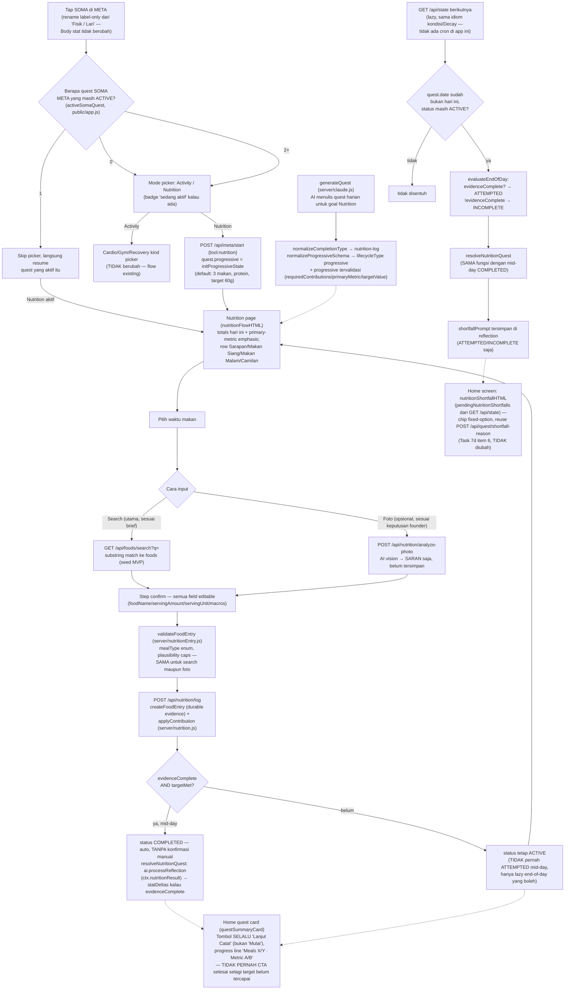

# SOMA Nutrition flow — Part B (PRD.md section 29)

Diagram alur PROGRESSIVE lifecycle untuk Nutrition (search-based + photo-optional
entry, evaluasi mid-day/end-of-day, shortfall banner), plus routing SOMA di META,
sesuai kode di `server/nutrition.js`, `server/nutritionEntry.js`, `server/db.js`,
`server/claude.js`, `server/index.js`, dan `public/app.js`. Dokumen ini WAJIB
tetap akurat terhadap kode — kalau alur berubah, update diagram ini juga.

Penjelasan node yang tidak jelas dari namanya:

- **activeSomaQuest** — "aktif" berarti quest META (bukan Today's Trial) yang
  `is_meta=true` dan `reflection IS NULL`, domain Activity
  (`completionType === "structured-physical"`) atau Nutrition
  (`completionType === "nutrition-log"`). Quest Today's Trial (goal-tied)
  TIDAK ikut dihitung di sini — routing SOMA di META hanya soal sesi META
  itu sendiri, konsisten dengan makna "META" (sesi bebas, di luar rotasi
  goal harian).
- **PROGRESSIVE vs SESSION** — `lifecycleType` field baru di quest jsonb.
  SESSION (cardio/gym/recovery/practice-test/job-match-analysis/
  job-application-submit, TIDAK DISENTUH) = generate → satu submit → selesai.
  PROGRESSIVE (nutrition-log, satu-satunya sejauh ini) = quest tetap terbuka
  sepanjang hari, menampung beberapa submission (`applyContribution`)
  sebelum status berubah dari ACTIVE.
- **evidenceComplete vs targetMet** — dua boolean TERPISAH, tidak pernah
  digabung jadi satu (prinsip anti-Goodhart yang sama dengan
  qualified-applications Livelihood): evidenceComplete = jumlah makan yang
  dicatat sudah cukup (compliance); targetMet = angka metrik utama
  (kalori/protein/karbo/lemak) sudah tercapai (pencapaian). Growth-gate
  hanya mensyaratkan evidenceComplete — targetMet TIDAK PERNAH menahan
  growth kalau compliance-nya sendiri sudah penuh.
- **COMPLETED mid-day, ATTEMPTED/INCOMPLETE hanya end-of-day** —
  `applyContribution` HANYA PERNAH menghasilkan status ACTIVE atau
  COMPLETED (kalau kedua boolean true di saat itu juga) — tidak pernah
  ATTEMPTED, supaya user yang sudah mencatat jumlah makan minimum tapi
  belum capai target tetap punya kesempatan makan lagi hari itu sebelum
  dianggap "gagal". ATTEMPTED/INCOMPLETE HANYA pernah muncul dari
  `evaluateEndOfDay`, dipanggil lazy oleh GET /api/state begitu
  `quest.date` sudah bukan hari ini lagi.
- **resolveNutritionQuest** — satu fungsi dipakai untuk KEDUA jalur resolusi
  (mid-day COMPLETED dari POST /api/nutrition/log, ATTEMPTED/INCOMPLETE dari
  GET /api/state) — memanggil `ai.processReflection` dengan
  `ctx.nutritionResult` (BUKAN flat-bump baru — reuse mekanisme growth yang
  sama dipakai structured-physical/practice-test, prinsip "no arbitrary
  points" Task 7d/14 tidak dibuka lagi untuk domain baru ini).
- **Nutrition page ganda-peran** — `nutritionFlowHTML()` sekaligus jadi
  "Nutrition page" (brief item 6: totals + meal rows + primary-metric
  emphasis) DAN UI logging itu sendiri — pola yang sama dengan
  jobMatchFlowHTML/practiceTestFlowHTML (layar flow khusus yang dibuka lewat
  "Mulai"/"Lanjut Catat", bukan tab nav permanen baru — tidak ada redesign
  navigasi yang diminta).
