# Video Quest (video-quiz) flow — LABORA design handoff

Diagram alur completionType `video-quiz` dari quest generation sampai quest
complete, sesuai kode di `server/claude.js`, `server/videoQuiz.js`,
`server/youtube.js`, `server/db.js`, `server/index.js`, dan `public/app.js`.
Dokumen ini WAJIB tetap akurat terhadap kode — kalau alur berubah, update
diagram ini juga.

Prinsip inti (kenapa source-locking): begitu assessment dimulai, video TIDAK
bisa diganti sampai lulus — skor assessment jadi sinyal nyata "apa yang
dipelajari dari video ITU", bukan pengetahuan umum. Ikon gembok (dan
"Pelajari Lagi" di layar gagal) selalu membuka kembali video yang sama.

```mermaid
flowchart TD
    GQ["generateQuest (server/claude.js)\nAI menulis quest harian — enum + aturan 'Pilih video-quiz HANYA kalau...'\n(goal soal menguasai topik yang wajar dipelajari dari video; harus jarang)"] --> CT{"completionType\n= video-quiz?"}
    CT -- "bukan" --> OTHER["flow lain"]
    CT -- "ya" --> VQS["videoQuiz {topic, passThreshold, estimatedMinutes}\nnormalizeVideoQuizSchema: topic WAJIB terisi (fallback ke title),\npassThreshold clamp 5-14 default 11, estimatedMinutes clamp 5-120 default 25.\nTopic STATIS per quest — menentukan video apa yang BOLEH dipilih"]
    META["Tab META → LABORA realm page\nrow 'Video Quest' → kartu input topik →\nPOST /api/meta/start {tool:'video-quest', topic}\n(user ketik topiknya sendiri; sesi bebas, goalIndex null)"] --> INTRO

    VQS --> TAP["Tap 'Mulai Quest' di dashboard\n(handler data-reflect-id; refresh /api/state dulu —\nlock bisa saja dibuat di tab/device lain)"]
    TAP --> LOCKED_Q{"quest.videoQuizState\n.lockedVideoUrl ada?"}
    LOCKED_Q -- "ya" --> LOCKEDVIEW
    LOCKED_Q -- "belum" --> INTRO["Intro (dalam chrome normal):\ntopik, 15 soal, ambang lulus, ±menit → 'Mulai Quest'"]

    INTRO --> PICK["'Pilih materi belajarmu' (takeover .vq-shell):\ntempel link YouTube → 'Periksa Materi'"]
    PICK --> VALIDATE["POST /api/video-quiz/validate\nparseVideoId → fetchVideoData (server/youtube.js:\noEmbed judul/kanal + innertube durasi/caption tracks,\ntranskrip cap 15.000 char) → judgeVideoRelevance\n(Claude: transkrip 6.000 char pertama vs topic → {relevant, rationale})"]
    VALIDATE -- "link invalid 400 /\nno captions 422 /\nnetwork 502" --> PICK
    VALIDATE -- "relevant=false\n(rationale ditampilkan,\ninput tetap — pilih video lain)" --> PICK
    VALIDATE -- "relevant=true" --> CAND["payload.candidate tersimpan di\ndays.video_quiz_payload (BELUM terkunci —\nre-check dengan URL lain bebas menimpa)"]
    CAND --> READY["'Materi siap': thumbnail + judul/kanal + rationale\n'Ganti Video' ← masih boleh /\n'Saya Sudah Belajar → Mulai Assessment'"]

    READY --> START["POST /api/video-quiz/start"]
    LOCKEDVIEW["Layar 'Materi dikunci untuk quest ini'\n(re-entry / 'Pelajari Lagi' setelah gagal):\nvideo sama, 'Buka Video' link eksternal,\nchip FOKUS ULANG kalau attempt terakhir gagal"] -- "Mulai/Ulang Assessment" --> START

    START --> CASE{"kasus?"}
    CASE -- "RESUME (locked + questions ada,\n!retry) — idempoten, reload aman" --> SERVE["kirim set yang SAMA\n(stripQuestions: tanpa correct/explanation)"]
    CASE -- "RETRY {retry:true}\n('Ulang Assessment')" --> REGEN["generateVideoQuizQuestions attempt+1\ndari TRANSKRIP TERKUNCI YANG SAMA\n(set soal baru, video tidak pernah berganti)"]
    CASE -- "FIRST START\n(butuh candidate.relevant)" --> GEN15["generateVideoQuizQuestions attempt 1:\nTEPAT 15 soal HOTS dari transkrip —\nq1-3 conceptual / q4-8 scenario / q9-11 error-identification /\nq12-14 best-practice / q15 multi-select (opsi 4-6, benar 2-4);\nvalidasi cleanVideoQuizPayload STRICT all-or-null, 1x retry, lalu THROW\n(gagal generate = video BELUM terkunci, masih bisa ganti);\nkeyless → VIDEO_QUIZ_FALLBACK statis"]
    GEN15 --> LOCK["SOURCE LOCK: candidate → locked di video_quiz_payload\n+ quest.videoQuizState {phase:'locked', lockedVideoUrl,\nlockedVideoMeta, attempt, lastResult} via updateQuestProgress\n(client-visible di GET /api/state — TANPA soal/transkrip)"]
    REGEN --> SERVE
    LOCK --> SERVE

    SERVE --> ASSESS["Assessment (takeover): 1 soal per layar,\nikon gembok → sheet materi terkunci,\n'Soal N dari 15' + progress bar → navigator sheet 15 sel,\nsingle = radio row, multi = checkbox row ('pilih semua yang benar');\njawaban in-flight CLIENT-ONLY (reload = jawab ulang, set sama)"]
    ASSESS --> REVIEW["'Review Jawaban': grid 15 sel answered/unanswered,\ntap = lompat ke soal; 'Kirim Jawaban' DIGERBANG 15/15\n+ confirm 'jawaban tidak dapat diubah'"]
    REVIEW --> SUBMIT["POST /api/video-quiz/submit"]
    SUBMIT --> GRADE["gradeAnswers (deterministik, server/videoQuiz.js):\nset-equality per soal (all-or-nothing, tanpa partial credit);\nconceptSplit → strongConcepts (semua soal konsep itu benar)\n/ weakConcepts (ada yang salah)"]

    GRADE --> PASS_Q{"score >= passThreshold\n(default 11/15)?"}
    PASS_Q -- "GAGAL" --> FAIL["Respons TANPA answer key/explanation/per-soal\n(jaga 'Ulang Assessment' tetap jujur);\nquest TETAP TERBUKA, lock TETAP, tanpa growth;\nvideoQuizState.lastResult diisi.\nLayar: 'BELUM LULUS' + chip FOKUS ULANG +\n'Pelajari Lagi' (→ layar terkunci) / 'Ulang Assessment' (→ RETRY)"]
    FAIL -.-> LOCKEDVIEW
    PASS_Q -- "LULUS" --> PIPE["pipeline completion yang sama dengan practice-test submit:\nprocessReflection (branch ctx.videoQuizResult — bukti objektif,\ntanpa gerbang kespesifikan) → clamp statDeltas 1-5 →\ngrowthSessions → gerbang chapter → saveReflection\n{status COMPLETED, videoQuizResult} → touchStatActivity → updateState"]
    PIPE --> RESULT["Respons LULUS: skor, chip kuat/lemah, mentorReply,\n+ review[] per-soal (prompt, jawabanmu, benar, explanation) —\nSATU-SATUNYA tempat answer key keluar server, hanya setelah lulus.\nLayar: LULUS → 'Lihat Pembahasan' / 'Selesaikan Quest'\n(refetch /api/state, quest tertutup)"]
```

Penjelasan node yang tidak jelas dari namanya:

- **Pemisahan penyimpanan** — `days.video_quiz_payload` (kolom baru, aturan
  isolasi answer-key yang sama dengan `practice_test_payload`): candidate,
  video terkunci + transkrip penuh (cap 15.000 char), dan 15 soal dengan
  kunci jawaban. `days.quest.videoQuizState` (client-visible via
  `rowToQuest`): hanya lock + meta video + attempt + lastResult — TIDAK
  PERNAH berisi soal/transkrip/kunci.
- **Retry pakai transkrip tersimpan** — "Ulang Assessment" TIDAK memanggil
  YouTube lagi; transkrip terkunci di payload dipakai ulang untuk generate
  set baru (attempt+1, prompt minta soal yang beda substansi). Video tidak
  pernah berganti sampai lulus.
- **server/youtube.js** — tanpa dependency (konvensi repo: global fetch,
  sama seperti callClaude). oEmbed itu stabil; endpoint innertube TIDAK
  resmi dan bisa berubah sewaktu-waktu — kegagalan dipetakan ke error
  berkode (`NO_CAPTIONS` → 422 "pilih video lain yang ada subtitle-nya",
  lainnya → 502 "coba lagi"). `ELEVA_YOUTUBE_STUB=1` mengembalikan fixture
  tetap tanpa network — dipakai e2e test dan dev keyless.
- **Keyless mode** — `judgeVideoRelevance` permisif (relevant=true dengan
  rationale "Mode offline"), `generateVideoQuizQuestions` menyajikan
  `VIDEO_QUIZ_FALLBACK` statis (15 soal generik "belajar efektif dari materi
  video", sudah lolos validator di module load). Grading/locking tetap
  deterministik penuh.
- **"+50 EXP" di desain** — server tidak punya EXP (PRD menolaknya
  eksplisit). Padanannya: pipeline statDeltas/growthSessions yang sama
  dengan practice-test — quest complete = reflection tersimpan + growth
  wajar dari `processReflection` (bukti objektif).
- **META vs Today's Trial** — dua pintu masuk, satu flow: quest harian AI
  (topic ditulis AI, statis) dan row LABORA "Video Quest" (topic diketik
  user saat mulai, lalu statis juga). `metaSessionCounts.labora` menjumlah
  `job-match-analysis` + `video-quiz` (pola yang sama dengan lingua).
